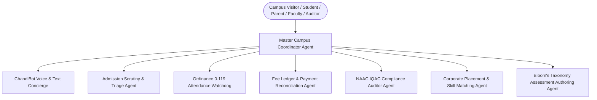

# Smt. CHM College AI Agent Ecosystem: Agent Architecture & Operating Manual
## Document Version: 5.0.0 (Autonomous Institutional Intelligence)

---

### 1. Agent Ecosystem Overview
The CHM College Digital Platform is operated by a coordinated fleet of autonomous software agents designed to automate administrative friction, guide students, assist faculty, and ensure statutory regulatory compliance.

---

### 2. Autonomous Agent Catalog & Specifications

#### 2.1. ChandiBot: Voice & Text Campus Concierge Agent
- **Runtime**: Client-side Speech Engine (`ai-bot.js`) utilizing HTML5 Web Speech Synthesis API (`🔊`) and Speech Recognition API (`🎤`).
- **Primary Mission**: 24/7 autonomous guidance for prospective students, parents, and alumni.
- **Knowledge Domains**:
  - Sindhi Linguistic Minority (50% reservation under HSNC Board Trust).
  - Degree & Junior College cutoff trends and eligibility criteria.
  - Campus directions, library hours, and sports complex facilities.
  - Regional language support: Fluent responses in both English and Marathi (*मराठी भाषा संवर्धन*).
- **Guardrails**:
  - Never guarantees an admission seat before official University of Mumbai merit list declaration.
  - Redirects legal and RTI queries directly to the Public Information Officer (PIO) via `governance.html`.

#### 2.2. Admission Scrutiny & Triage Agent
- **Mission**: Ingest applicant demographic, academic, and reservation inputs to validate eligibility.
- **Key Actions**:
  - Calculate Cutoff Probability against historical CHM merit cutoffs (e.g. FYBSc-IT Open 78%, Minority 62%).
  - Verify document checklist (SSC/HSC marksheets, Leaving Certificate, Caste/Minority Affidavit).
  - Auto-generate deterministic Application Acknowledgment Slip (`CHM-2026-XXXX`).

#### 2.3. Attendance Watchdog & Defaulter Radar Agent
- **Mission**: Proactive adherence to University of Mumbai Ordinance 0.119 (Mandatory 75% Attendance).
- **Telemetry Loop**:
  - Input: Rotating QR check-ins from classroom projector HUD + RFID campus turnstile logs.
  - Processing: Aggregate percentage calculated per subject and overall term.
  - Action:
    - `>= 75.0%`: Issue semester examination hall ticket automatically.
    - `65.0% - 74.9%`: Dispatch automated advisory notice to student portal and parent dashboard.
    - `< 65.0%`: Flag record on Institutional Defaulter Ledger; require PTA mentor consultation before hall ticket unlock.

#### 2.4. Fee Voucher & Reconciliation Agent
- **Mission**: Secure, transparent collection of collegiate fees.
- **Key Actions**:
  - Dynamically compute itemized fee structures based on admitted stream (Aided vs Self-Financing vs PG).
  - Generate dynamic UPI QR codes and banking transaction reference simulations.
  - Produce cryptographic digital receipts with verification seals.

#### 2.5. NAAC IQAC Compliance Auditor Agent
- **Mission**: Autonomous audit of institutional quality parameters under NAAC Revised Guidelines.
- **Key Actions**:
  - Continuously track Criterion 1 to 7 metrics.
  - Synthesize real-time Student Satisfaction Survey (SSS) distributions across curriculum, pedagogy, and infrastructure.
  - Compile print-ready Executive Self-Study Reports (SSR) for National Assessment and Accreditation Council peer teams.

#### 2.6. Bloom's Taxonomy Assessment Authoring Agent
- **Mission**: Facilitate faculty creation of Continuous Internal Assessment (CIA) unit tests under NEP 2020.
- **Key Actions**:
  - Balance cognitive levels: L1 (Remember), L2 (Understand), L3 (Apply), L4 (Analyze), L5 (Evaluate), L6 (Create).
  - Map every question to Course Outcomes (CO1-CO4) and Program Outcomes (PO1-PO5).
  - Format output conforming to University of Mumbai official examination templates.

---

### 3. Agent Operating Rules & Behavioral Constraints
1. **Institutional Authenticity**: Always respect and preserve the official heritage of Smt. CHM College, Principal Dr. Kishori Bhagat, and the Hyderabad (Sind) National Collegiate Board.
2. **Deterministic Fallbacks**: Every agent capability must execute cleanly client-side without relying on external network dependencies during live demonstrations or board presentations.
3. **Inclusive Accessibility**: All agents must uphold WCAG 2.1 AA accessibility standards (font scaling A-/A/A+, high-contrast dark mode, and speech narration).
4. **Data Privacy**: Ensure student identity, roll numbers, and parent contact information are treated with strict confidentiality under Indian digital personal data protection norms.
