# Smt. CHM College Enterprise Digital Campus: System Brain & Architecture Manifesto
## Document Version: 5.0.0 (Autonomous Institutional Grade)

---

### 1. Executive Vision & Institutional Mandate
The **Smt. Chandibhai Himathmal Mansukhani College (CHM College)** Enterprise Digital Campus is an integrated, self-contained educational operating system. Built for the **Hyderabad (Sind) National Collegiate (HSNC) Board, Mumbai** and affiliated with the **University of Mumbai**, this platform replaces legacy fragmented university software (standalone portals, physical bulletin boards, manual attendance registers, paper receipts) with an all-in-one institutional cloud hub.

---

### 2. High-Level Architectural Topology

```mermaid
graph TD
    User([End Users: Students, Parents, Faculty, NAAC Auditors, Recruiters]) --> CDN[Edge Cache / Reverse Proxy NGINX]
    CDN --> WebLayer[18+ Interactive Modular Workspaces]
    
    subgraph WebLayer [Presentation & Interactive UI Layer]
        Index[Institutional Core index.html]
        ERP[Student & Faculty ERP portal.html]
        Adm[Paperless Admissions admission.html]
        Fee[Voucher & UPI Gateway fee-payment.html]
        Exam[University Exam Desk exams.html]
        NAAC[NAAC IQAC Radar naac-iqac.html]
        CPT[Career Placements placement.html]
        Alumni[Global Alumni Network alumni.html]
        Res[Ph.D. & Incubation research.html]
        Fac[Faculty Directory faculty.html]
        Parent[Parent Watchdog parent-portal.html]
        Gov[Governance & RTI governance.html]
        Tour[Virtual 360 Tour campus-tour.html]
        Sch[MahaDBT Desk scholarships.html]
        Bank[PYQ Archive question-bank.html]
        Fest[Campus Fests events.html]
        Lib[Central E-Library digital-library.html]
        Bloom[Assessment Tool assessment-tools.html]
        Clubs[Extension NSS/NCC clubs.html]
    end

    WebLayer --> ClientEngines[Client-Side Micro-Engines]

    subgraph ClientEngines [Autonomous Client Processing Engines]
        ChandiBot[ChandiBot Voice & Text AI Engine]
        AttendanceWatchdog[Ordinance 0.119 Defaulter Predictor]
        NEPTimetable[NEP 2020 Slot Scheduler]
        CutoffEngine[Historical Cutoff Qualification Engine]
        TokenSigner[Deterministic Slip & Voucher Generator]
        BloomsCalculator[Cognitive Balance & CO-PO Attainment]
    end

    ClientEngines --> LocalPersistence[(Local Cache / Offline State / Session DB)]
```



---

### 3. Core Domain Models & State Automata

#### 3.1. Student Academic Lifecycle State Machine
Every student record transitions through deterministic states from admission inquiry to convocation:

```
[Inquiry / Cutoff Predictor] 
       │
       ▼
[4-Step Online Application (CHM-2026-XXXX)] 
       │
       ▼
[Merit List Scrutiny & Document Verification] 
       │
       ▼
[Fee Voucher Generation & UPI E-Receipt] 
       │
       ▼
[Active Enrolled Student ERP (PRN Issued)] 
       │
       ├── Attendance Watchdog (>=75% Green | <75% Defaulter Alert)
       ├── Internal Assessment & CIA Tests (Bloom's Taxonomy)
       ├── Extension Activities (NSS / NCC 120-Hour Social Credits)
       └── Semester Examination Clearance (Hall Ticket Release)
       │
       ▼
[Degree Completion / University Convocation] 
       │
       ▼
[Global Alumni Network & Mentorship Council]
```

#### 3.2. University of Mumbai Ordinance 0.119 Attendance Model
- **Legal Mandate**: Minimum 75% aggregate physical/practical attendance required to appear for semester end examinations.
- **Defaulter Formula**:
  $$\text{Attendance \%} = \left( \frac{\text{Total Lectures Attended}}{\text{Total Lectures Conducted}} \right) \times 100$$
- **Color Thresholds**:
  - `Aggregate >= 75.0%`: Normal Standing (`status-safe`). Exam hall ticket unlocked automatically.
  - `65.0% <= Aggregate < 75.0%`: Advisory Notice. Automated parent SMS dispatch and mentor counseling warning.
  - `Aggregate < 65.0%`: Critical Defaulter List (`status-danger`). Exam hall ticket conditionally withheld pending College Attendance Committee review and medical affidavit submission.

#### 3.3. NEP 2020 Credit Framework & Timetable Matrix
- **Lecture Slots**: Standard 50-minute credit blocks (07:15 AM to 01:05 PM).
- **Major / Minor Discipline Weightage**: 3.0 Credits for core lecture modules, 2.0 Credits for laboratory practicals.
- **Continuous Internal Assessment (CIA)**: 25% Internal Continuous Evaluation + 75% End-Semester University Examination.

---

### 4. NAAC 7-Criteria Compliance Mapping Engine

The system is intrinsically mapped to the Revised Assessment and Accreditation Framework of NAAC:

| NAAC Criterion | System Module | Implementation & Telemetry |
|---|---|---|
| **Criterion 1: Curricular Aspects** | `portal.html`, `assessment-tools.html` | NEP 2020 Credit matrices, elective subject options, academic calendars, curriculum feedback modules. |
| **Criterion 2: Teaching-Learning & Evaluation** | `faculty.html`, `parent-portal.html`, `exams.html`, `assessment-tools.html` | Bloom's taxonomy internal tests, mentor-mentee allocation, student-teacher ratio tracking, live attendance watchdog, continuous evaluation records. |
| **Criterion 3: Research, Innovations & Extension** | `research.html`, `clubs.html` | 5 Ph.D. Research Centers, Scopus/WoS publication repository, Patents showcase, CHM-EDC startup incubation, NSS/NCC extension activities. |
| **Criterion 4: Infrastructure & Learning Resources** | `digital-library.html`, `campus-tour.html` | 60,000+ volume library OPAC, N-LIST e-journal subscriptions, virtual 360° facility walkthrough, IT labs with gigabit fiber backbone. |
| **Criterion 5: Student Support & Progression** | `scholarships.html`, `placement.html`, `alumni.html`, `question-bank.html` | MahaDBT scholarship eligibility engine, corporate placement statistics (₹12.5 LPA), global alumni mentorship, past exam papers. |
| **Criterion 6: Governance, Leadership & Management** | `governance.html` | College Development Committee (CDC), RTI Section 4 disclosure, SGRC grievance token tracking, POSH/ICC compliance. |
| **Criterion 7: Institutional Values & Best Practices** | `index.html`, `events.html` | Sindhi linguistic minority preservation, Chandi Utsav cultural celebration, green campus initiatives, gender equity cell. |

---

### 5. Security & Verification Architecture
1. **Zero-Trust Verification Stamps**: Every generated receipt, slip, bonafide certificate, and hall ticket contains an alphanumeric token signed with date, PRN, and session hashing (e.g. `CHM-2026-XXXX`).
2. **Dynamic Rotating Tokens for Anti-Proxy Attendance**: The classroom projector attendance HUD refreshes every 10 seconds with cryptographic rotating tokens to prevent remote attendance spoofing.
3. **Parent 2FA Verification**: Guardian phone numbers require OTP validation before granting access to confidential academic performance and defaulter warnings.
4. **Content Security Policy (CSP)**: Hardened headers prohibiting unauthorized script injection, cross-site frame hijacking, and remote asset tampering.

---

### 6. Deployment & Scalability Guidelines
- **Stateless Edge Delivery**: Built with standards-compliant HTML5, CSS3, and ES6 JavaScript. Runs with zero backend dependencies for offline pitches, yet containerizes seamlessly into Docker NGINX Alpine for millions of requests.
- **Horizontal Scalability**: Static assets served through high-efficiency CDNs (Cloudflare, AWS CloudFront, or NGINX edge caches) with gzip compression and immutable asset hashes.
